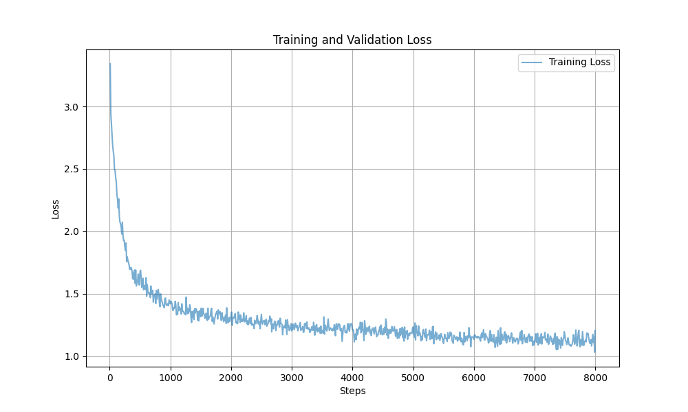
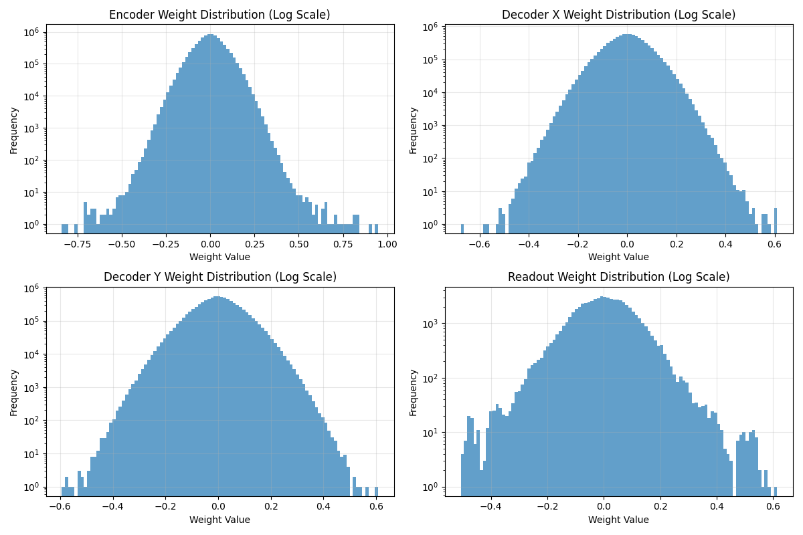

# Dragon Hatchling (BDH) 実装

このリポジトリは、論文 ["Dragon Hatchling: The Missing Link Between the Transformer and Models of the Brain"](https://arxiv.org/abs/2509.26507) に基づく **Dragon Hatchling (BDH)** モデルの PyTorch 実装を含んでいます。

## 概要

Dragon Hatchling モデルは、現代の Transformer アーキテクチャと生物学的ニューラルネットワークの間のギャップを埋めるものです。この実装では、テンソル処理ユニット向けに最適化された **BDH-GPU** バリアントに焦点を当てています。

**主な特徴:**
*   **BDH-GPU アーキテクチャ:** 生物学的モデルのテンソルフレンドリーな実装。
*   **線形注意機構 (Linear Attention):** 効率的な $O(TK)$ の注意機構。
*   **Rotary Positional Embeddings (RoPE):** 位置エンコーディングの強化。
*   **Hugging Face Hub 統合:** モデルのアップロードとダウンロードをシームレスに統合。

## インストール

このプロジェクトでは依存関係の管理に `uv` を使用しています。

```bash
# uv がまだインストールされていない場合
curl -LsSf https://astral.sh/uv/install.sh | sh

# リポジトリのクローン
git clone https://github.com/kubotadaichi/dragon-hatchling.git
cd dragon-hatchling

# 依存関係のインストール
uv sync
```

## 使用方法

### 学習 (Training)

Wikitext-2 データセットでモデルを学習するには:

```bash
uv run experiment.py --epochs 3 --batch_size 8 --device cuda
```

**引数:**
*   `--push_to_hub`: チェックポイントを Hugging Face Hub にアップロードします。
*   `--hf_repo_id`: アップロード先のリポジトリID (例: `username/dragon-hatchling`)。

### 評価 (Evaluation)

学習済みモデル（ローカルまたは HF Hub）を評価するには:

```bash
uv run evaluate.py --model_path <path-or-repo-id>
```

例:
```bash
uv run evaluate.py --model_path daichi202/dragon-hatchling --max_chunks 100
```

## 実装レポート

### 実装詳細
論文の付録 E に記載されているモデルの GPU フレンドリーバージョンである **BDH-GPU** を実装しました。

#### 主要コンポーネント
- **BDH-GPU アーキテクチャ:** `model.py` に実装されています。
- **線形注意機構:** 計算量 $O(TK)$ で実装。
- **Rotary Positional Embeddings (RoPE):** 位置認識能力を向上させるために追加しました。
- **学習スクリプト:** `experiment.py` はデータ読み込み (Wikitext-2)、学習ループ、Hugging Face Hub 統合を処理します。

### 実験設定
- **データセット:** Wikitext-2 (バイトレベルのトークナイゼーション)
- **モデルパラメータ:**
    - 隠れ層の次元 ($D$): 256
    - ヘッド数 ($H$): 4
    - ニューロン数 ($N$): 32768
    - レイヤー数 ($L$): 2
    - 語彙サイズ: 256
- **学習:**
    - エポック数: 3
    - バッチサイズ: 8
    - シーケンス長: 128
    - オプティマイザ: AdamW (lr=1e-3)

### 結果

#### 学習の収束
学習損失は着実な収束を示し、約 3.34 から開始してステップ 2600 までに約 1.03 まで減少しました。



*図 1: ステップごとの学習損失と検証損失*

#### 評価指標
Wikitext-2 検証セットでの評価結果:

- **平均検証損失:** 1.2365
- **パープレキシティ (バイトレベル):** 3.4434

このパープレキシティは、モデルがバイトシーケンス内の構造的パターンを学習することに成功しており、ランダムな確率 (パープレキシティ ~256) を大幅に上回っていることを示しています。

#### 重み分析
"Dragon Hatchling" 仮説は、学習された重みが初期化から大きく逸脱し、生物学的シナプスと同様にヘビーテール分布を示す可能性があることを示唆しています。



*図 2: 学習されたパラメータの重み分布*

### 結論
BDH-GPU 実装は機能しており、テキストデータから学習することが可能です。Hugging Face Hub との統合により、共有とリモート実験が容易になっています。今後、モデルの規模拡大（より大きな $N$、より多くのレイヤー）や、より大規模なデータセットでの評価を行い、論文で提案されているスケーリング則を完全に検証する必要があります。

## ライセンス

MIT
